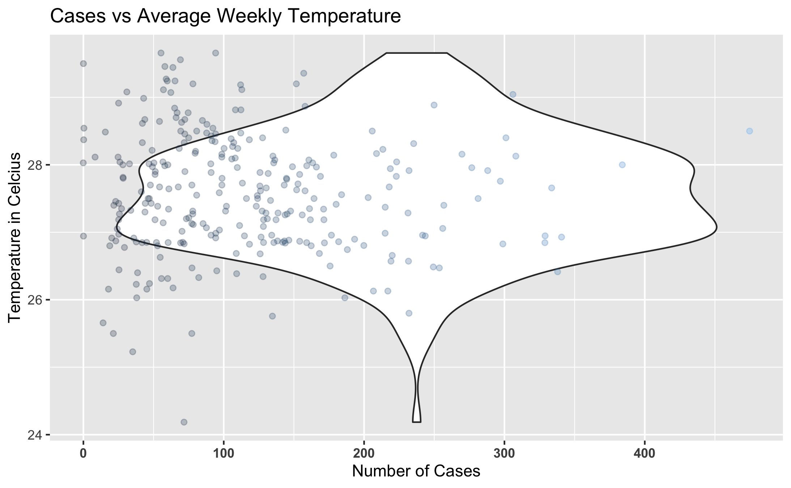
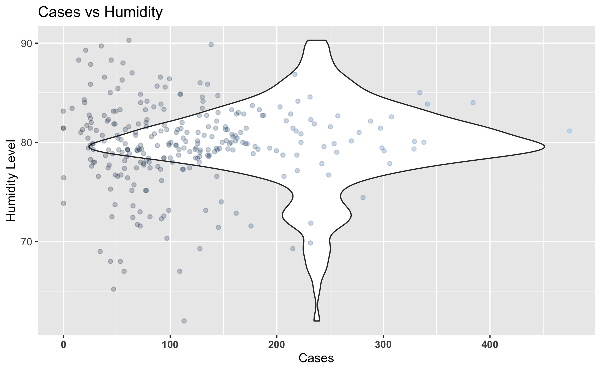

# Summary/Abstract
_Dengue is often regarded globally as the most important mosquito-borne viral disease. The virus and its vectors have now become widely distributed throughout tropical and subtropical regions of the world, particularly over the last half-century. Significant geographic expansion has been coupled with rapid increases in incident cases, epidemics, and hyperendemicity, leading to the more severe forms of dengue. Transmission of dengue is now present in every World Health Organization (WHO) region of the world and more than 125 countries are known to be dengue endemic. The true impact of dengue globally is difficult to ascertain due to factors such as inadequate disease surveillance, misdiagnosis, and low levels of reporting. Currently available data likely grossly underestimates the social, economic, and disease burden. Estimates of the global incidence of dengue infections per year have ranged between 50 million and 200 million; however, recent estimates using cartographic approaches suggest this number is closer to almost 400 million. The expansion of dengue is expected to increase due to factors such as the modern dynamics of climate change, globalization, travel, trade, socioeconomics, settlement and also viral evolution. Here we examine a collection of Data from the District of Colombo in Sri Lanka, looking at Recorded Cases of Dengue each week from 2008-2014. Our analysis looks at various climate conditions sampled each week and draw conclusions as to which of these variables have a strong correlation with fluctuations in Recorded Cases of Dengue._

# Introduction

## General Background Information
Dengue is a disease caused by a family of viruses transmitted to people through the bite of an infected Aedes species (Ae. aegypti or Ae. albopictus) mosquito. Symptoms of Dengue fever include severe joint and muscle pain, swollen lymph nodes, headache, fever, exhaustion, and rash. The presence of fever, rash, and headache (the "Dengue Triad") is characteristic of dengue fever. Each year, up to 400 million people get infected with Dengue. Approximately 100 million people get sick from infection, and 22,000 die from severe Dengue. Dengue is caused by one of any of four related viruses: Dengue virus 1, 2, 3, and 4.  For this reason, a person can be infected with a Dengue virus as many as four times within their lifetime. Dengue virus is prevalent throughout the tropics and subtropics; being common in over 100 countries in the world. Forty percent of the world’s population, about 3 billion people, live in areas with a risk of Dengue. Because of this, Dengue is often a leading cause of illness in areas with risk. It is clear that Dengue places a significant socioeconomic and disease burden on many tropical and subtropical regions of the world. It is currently regarded as the most important arboviral disease internationally as over 50% of the world’s population live in areas where they are at risk of the disease, and approximately 50% live in dengue endemic countries.
Dengue outbreaks occur in many countries around the world, varied among the Americas, Africa, the Middle East, Asia, and the Pacific Islands. Many of these countries at risk are below an elevation of 6,500 feet. Sri Lanka is among the countries in which the Center for Disease Control labels Frequent/Continuous for the number of outbreaks of Dengue year to year. In 2010, the WHO reported 26,824 Cases of Dengue in Sri Lanka, leading to a reported 192 Deaths. In a more recent account in Sri Lanka, there were 180,000 reported cases in 2017; the majority of cases being reported from the Western province. The highest numbers of Dengue cases were reported during the 20th week of 2017. Sri Lankan health authorities warned that the country was facing a Dengue epidemic with at least 301 patients dead. It is clearly evident from data collated by WHO that, in South East Asia, an overall expansion of dengue has occurred over the last decade. In 2003, eight countries in SEA had reported cases of dengue and, by 2009, all SEA member countries excluding the Democratic People’s Republic of Korea reported indigenous cases. Epidemics continue to persist on regular 3–5 year cycles throughout SEA, and the number of reported cases continues to increase along with the severity of cases in many member countries.

## Description of Data & Data Source
The following data is a collective of samples of weekly notified Dengue cases and climate variables in the Colombo district of Sri Lanka between the years of 2008 to 2014. Within the data frame there are 279 rows and 12 variables. During the sample time, the 12 tested variables were: Total number of notified Dengue cases (Cases), Year (Year), Week number to locate the week within a year (Week), Week_Continuous across 6 years, Average temperature of the week (TEM), maximum temperature of the week (TMAX), Minimum temperature of the week (Tm), Sea level pressure (SLP), Relative humidity (H), Precipitation amount (PP), Mean visibility (VV), Mean wind speed (V), and Maximum sustained wind speed (VM). An additional variable was added by myself, named "Week Continuous", to show a full timescale of changes across the years, week by week.

The data was provided by Thiyanga Talagala, and published in 2018, taken from the weekly epidemiological reports published by the Epidemiological Unit, Ministry of Health, Sri Lanka. You can find the link to the data [here](https://CRAN.R-project.org/package=colmozzie).

## Questions/Hypotheses to be Addressed
_Examine Seasonal Changes across the Timespan of the Data Collection to observe any noticeable changes that may play a role in the number of Cases of Dengue recorded._

_Which variable/variables are the best indicators for Dengue?_

_Can the indicators for Dengue be applied to similar ecosystems across the world devoid of Dengue if the vector was introduced to that area to provide an example as to how many cases of Dengue in those areas we would see?_

_Do Changes in Temperature in tropical/subtropical zones effect the Vector spreading Dengue?_

_Does Precipitation attribute to higher Dengue cases?_

_What additional variables would be beneficial to include in the dataset for future studies?_

# Methods and Results
The data was provided by Thiyanga Talagala taken from the weekly epidemiological reports published by the Epidemiological Unit, Ministry of Health, Sri Lanka. Data was further cleaned by myself to better fit my analysis. Data was analyzed using R Studio software and various R packages listed throughout the repository provided by Github. Methods will include examining the variables in detail to see which ones are the best predictors and indicators for Dengue. Comparing each other variable to the number of cases of Dengue provides us with some ideas on what variables seem to have the most weight when it comes to identifying Dengue predictors, or at least which variables correlate with the number of Cases of Dengue.

## Data Aquisition, Import, and Cleaning
You can find the link to the data [here](https://CRAN.R-project.org/package=colmozzie). Due to the fact our data was very clean from the start, we did not require a lot of script to purify our data. I did add an additional variable that counts the weeks in a continous fashion in order to examine the data over the course of the years of collection. You can examine the cleaning script in the code folder inside the DengueProcessing_cleaning.Rmd.

## Univariate analysis
An Exploratory analysis of the cleaned Dengue dataset shows some general trends across the variables measured against the number of Cases of Dengue reported each week, and identifies specific aspects of the code that possibly warrant a deeper analysis. Each variable we examined was compared to the Reported Number of Dengue Cases Weekly, as we are searching for trends among what variables may attribute to a higher percentage of Cases of Dengue.
Here we observe some general trends among the climate conditions and how the effect the number of Recorded Cases of Dengue. Sri Lanka is considered a tropical zone, featuring wet and dry seasons. We can observe these changes, seen in Figures 1 through 11. 

```{r 1Fig, fig.cap="Number of Dengue Cases Reported Weekly Each Year.", echo=FALSE}

```

_Here we examine the distribution of recorded cases of Dengue in the Colombo District of Sri Lanka from years 2008 - 2014. Notable patterns exist where you can see an average number of cases falling among the 100 - 200 Cases Per Week across the six year span._


```{r 2Fig, fig.cap="Number of Dengue Cases Reported Each Week.", echo=FALSE}
knitr::include_graphics("../../results/Cases_v_Week.png")
```

_Here is a distribution of the average recorded cases per week across the years of the study. This gives us a closer look at the trend of Dengue cases increases during certain weeks of the year, while decreasing in others._

```{r 3Fig, fig.cap="Number of Dengue Cases Reported Each Week Continuously.", echo=FALSE}
knitr::include_graphics("../../results/Cases_v_WeekContinuous.png")
```

_Here is a distribution of the number of recorded Dengue Cases across the 279 Weeks within the 2008-2014 year span. The same pattern can be observed here that was seen in the the previous two graphs._

```{r 4Fig, fig.cap="Number of Dengue Cases Weekly against the Average Temperature.", echo=FALSE}

```

_Here we examine how the Average Temperature compares to the Number of Recorded Cases of Dengue. We can observe that the majority of our Cases of Dengue were recorded at a temperature between 26-28 degrees Celcius._

```{r 5Fig, fig.cap="Number of Dengue Cases Weekly against the Temperature Maximum.", echo=FALSE}
knitr::include_graphics("../../results/Cases_v_TemperatureMax.png")
```

_Here we examine the comparison of the number of Record Dengue Cases Weekly against the Weekly Temperature Maximum._

```{r 6Fig, fig.cap="Number of Dengue Cases Weekly against the Sea Level Pressure.", echo=FALSE}
knitr::include_graphics("../../results/Cases_v_SLP.png")
```

_Above is the comparison of Sea Level Pressure differences against the number of recorded Cases of Dengue each week._

```{r 7Fig, fig.cap="Number of Dengue Cases Weekly against Precipitation.", echo=FALSE}
knitr::include_graphics("../../results/Cases_v_Precipitation.png")
```

_Here is look at the comparison of Recorded Dengue Cases against the Percipitation per week. We can observe that most Cases occur while there is little percipitation._

```{r 8Fig, fig.cap="Number of Dengue Cases Weekly against the Mean Wind Speed.", echo=FALSE}
knitr::include_graphics("../../results/Cases_v_MeanWindspeed.png")
```

_While comparing the number of Cases of Dengue to the Mean Wind Speed, we can observe that most Cases are recorded around a Windspeed of ~5 knots._

```{r 9Fig, fig.cap="Number of Dengue Cases Weekly against Maximum Wind Speed.", echo=FALSE}

```

_While comparing the number of Recorded Cases of Dengue to the Maximum Wind Speed, we can observe that most Cases are recorded around the ~10 knot mark._

```{r 10Fig, fig.cap="Number of Dengue Cases Weekly against Relative Humidity.", echo=FALSE}

```

_The most cases of Dengue recorded weekly fall within a humidity level between 75-85% Humidity._

```{r 11Fig, fig.cap="Number of Dengue Cases Weekly against Mean Visibility.", echo=FALSE}
knitr::include_graphics("../../results/Cases_v_MeanVisibility.png")
```

_The most recorded Cases of Dengue occur with a Mean Visibility of around 18-20._

## Bivariate Analysis
A Bivariate Analysis is the simultaneous analysis of two variables (attributes). It explores the concept of relationship between two variables, whether there exists an association and the strength of this association, or whether there are differences between two variables and the significance of these differences. Here we compare the climate conditions to each other to look for any patterns to draw conclusions from, beginning with a simple Correlation Plot among the variables.

```{r 12Fig, fig.cap="Correlation among Variables.", echo=FALSE}
knitr::include_graphics("../../results/DengueCorr.png")
```

_We can see that there are only a few strong positive correlations among our variables, as well as a few strong negative correlations._


### Climate Condition Comparisons
_For the first part of this analysis, we will examine a few variables against each other: Average temperature of the week (TEM), Relative humidity (H), Precipitation Level (PP), and Mean wind speed (V). We are looking for any general trends among these climate conditions._

```{r 13Fig, fig.cap="Comparison of Average Temperature versus Average Precipitation.", echo=FALSE}
knitr::include_graphics("../../results/Temp_vs_Precip.png")
```

```{r 14Fig, fig.cap="Comparison of Average Temperature versus Mean Windspeed.", echo=FALSE}
knitr::include_graphics("../../results/Temp_vs_MeanWS.png")
```

```{r 15Fig, fig.cap="Comparison of Average Temperature versus Relative Humidity.", echo=FALSE}
knitr::include_graphics("../../results/Temp_vs_Humid.png")
```

```{r 16Fig, fig.cap="Comparison of Average Precipitation versus the Mean Windspeed.", echo=FALSE}
knitr::include_graphics("../../results/Precip_vs_MeanWS.png")
```

```{r 17Fig, fig.cap="Comparison of Relative Humidity versus Average Precipitation.", echo=FALSE}
knitr::include_graphics("../../results/Humid_v_Precip.png")
```

```{r 18Fig, fig.cap="Comparison of Relative Humidity versus Mean Windspeed.", echo=FALSE}
knitr::include_graphics("../../results/Humid_vs_MeanWS.png")
```


_From what we can see, we can make some general assumptions based on the graphs as well as what we know to be common  knowledge about weather effects. Looking at the graphs, Lower Temperatures are usually correlated with more more Percipitation, and Higher Humidity is correlated with higher Percipitation._

### Seasonal Changes
_Another aspect I want to look at would be examining seasonal changes and seeing as how they compare to the number of Cases of Dengue. Using this we can hopefully find some additional correlations and break down the information to get a more in depth visualization of how the number of cases of Dengue changes seasonally. Sri Lanka's climate is tropical and consists of distinct wet and dry seasons. Generally speaking, the coastal areas of Sri Lanka enjoy temperatures averaging 28°C (82°F) while the upland areas are cooler and more temperate, with a yearly average around 16-20°C (60-68°F). Our data was collected in the Colombo district, which lies on the western side of Sri Lanka. It is Sri Lanka's largest city, and often hot, wet, and humid year-round._

_Here we examine the Temperature changes across the time._

```{r 19Fig, fig.cap="Comparison of Average Temperature Across Years.", echo=FALSE}
knitr::include_graphics("../../results/Year_vs_Temp.png")
```

```{r 20Fig, fig.cap="Comparison of Average Temperature Across Each Week Continuously.", echo=FALSE}
knitr::include_graphics("../../results/WeekCont_vs_Temp.png")
```

```{r 21Fig, fig.cap="Comparison of Average Temperature Across Each Week of the Year.", echo=FALSE}
knitr::include_graphics("../../results/Week_vs_Temp.png")
```

_Our temperatures seem to fluctuate normally throughout the months and years present. Now let's check out some other variables in a comparison before finally comparing it to the Cases of Dengue. What we are looking for is something interesting to account for months with higher cases of Dengue. Here we will check out how the Precipitation changes over time._

```{r 22Fig, fig.cap="Comparison of Average Precipitation Across Years.", echo=FALSE}
knitr::include_graphics("../../results/Year_vs_Precip.png")
```

```{r 23Fig, fig.cap="Comparison of Average Precipitation Across Each Week Continuously.", echo=FALSE}
knitr::include_graphics("../../results/WeekCont_vs_Precip.png")
```

```{r 24Fig, fig.cap="Comparison of Average Precipitation Across Each Week of the Year.", echo=FALSE}
knitr::include_graphics("../../results/Week_vs_Precip.png")
```

_We see a rather wide distribution in the Percipitation across the timespan of the study. Nothing stands out as odd._

_Now we will examine the changes in Humidity._

```{r 25Fig, fig.cap="Comparison of Relative Humidity Across Years.", echo=FALSE}
knitr::include_graphics("../../results/Year_vs_Humid.png")
```

```{r 26Fig, fig.cap="Comparison of Relative Humidity Across Each Week Continuously.", echo=FALSE}
knitr::include_graphics("../../results/WeekCont_vs_Humid.png")
```

```{r 27Fig, fig.cap="Comparison of Relative Humidity Across Each Week of the Year.", echo=FALSE}
knitr::include_graphics("../../results/Week_vs_Humid.png")
```

_Our Humidity remains fairly standard for a tropical climate, as expected._

_Here are the changes in the Mean Windspeed._

```{r 28Fig, fig.cap="Comparison of Mean Windspeed Across Years.", echo=FALSE}
knitr::include_graphics("../../results/Year_vs_Windspeed.png")
```

```{r 29Fig, fig.cap="Comparison of Mean Windspeed Across Each Week Continuously.", echo=FALSE}
knitr::include_graphics("../../results/WeekCont_vs_Windspeed.png")
```

```{r 30Fig, fig.cap="Comparison of Average Temperature Across Each Week of the Year.", echo=FALSE}
knitr::include_graphics("../../results/Week_vs_Windspeed.png")
```
 
_Windspeed various across the span of the study, with a slight increase from Weeks 20 to 30._


## Full Analysis

Work in Progess, Figures won't load.

_Use one or several suitable statistical/machine learning methods to analyze your data and to produce meaningful figures, tables, etc. This might again be code that is best placed in one or several separate R scripts that need to be well documented. You can then load the results produced by this code_

# Discussion

## Summary and Interpretation
Overall, the study examined a variety of weather patterns and climate conditions in order to observe their effects on the number of recorded cases of Dengue in the Colombo District of Sri Lanka from the years 2008-2014. While observing noticeable trends in the climate conditions, as expected for the tropical zone in which Sri Lanka is located, the data eludes to some possible connections as to which of these variables played the most important role in Determining the number of Cases of Dengue that were Recorded.

It can be said that higher levels of precipitation lead to more bodies of water capable of housing Mosquito larvae, thus attributing to more mosquitos suriving and being able to act as more vectors for Dengue to spread from person to person. The average mosquito life cycle from egg to adult takes around an average of 8-10 days, giving reason as to why there is some delay in why a higher level of precipitation might not correlate with a higher level of recorded Cases of Dengue due to the delay between lifespans of capable mosquitos. In addition to this, an adult female mosquito must first feed on a person who has Dengue in order to harbor the disease and spread it to another human. Despite this time delay, be It can be inferred from the data that higher precipitation levels a few weeks beforehand attribute to higher cases of Dengue seen weeks afterwards. 


## Strengths and Limitations

### Strengths
There were notable strengths while conducting this Analysis. A great strength in the analysis was being able to have consistant data across a long period of time without any unavailable data for each variable from week to week. Another powerful strength in the analysis was being able to draw data from a multitude of climate conditions, varying from Sea Level Pressure to Maximum Windspeed. While some of these proved little worth as far as causation goes during the Analysis, it was important to examine them as trends to follow to note observable changes. 

### Limitations
There were notable limitations while conducting this Analysis. One of these limitations was having limited knowledge on the whereabouts of where the subjects in the data collection were located within the District of Colombo in Sri Lanka. While the raw number of Cases each week is a critical piece of the study, there is much left to the imagination as to what other variables would be necessary to conduct a more in depth analysis to better determine the attributing climate conditions to Dengue. Additionally, we must infer a lot of prior knowledge on the Disease Vector and how Sri Lankan Society tries to mitigate it. While the data provides detailed raw climate conditions, we lack the knowledge of how the district of Colombo works to stop the spread of this disease. While Climate conditions obviously play a critical role in harboring vectors to spread the disease, there are numerous other factors that play a role in disease spread and prevention that were unavailable as data that could be used for this study.

## Conclusions
In conclusion, we have examined the climate conditions from 2008-2014 to get a better estimate of which conditions may play a role in attributing to higher recorded Cases of Dengue in Colombo, Sri Lanka. While seeing very little correlation among the various tested climate conditions, we can still make inferred conclusions drawn upon what we know about the Diseases Vector and its habitat. It is known that higher percipitation levels leave more bodies of water available for Mosquitos to repopulate, thus giving rise to more vectors in order to further spread Dengue. From our Analyses we can infer that higher precipitation levels weeks beforehand cause an observable increase in the number of Cases of Dengue observed weeks later. While other variables seem to have little direct causation for an increase in the disease, we can attribute this to the relatively stable tropical climate of Sri Lanka, which maintains a relatively high humidity, temperature, and consistant climate conditions, all of which are perfect for the Aedes Mosquito. 


_Include citations in your Rmd file using bibtex, the list of references will automatically be placed at the end_

# References

# Illustrating setup
_This section is only there to show how to insert results from other places in the project and how to cite figures and other references. Delete this whole section at some point._


This paper [@Leek2015a] discusses types of analyses. 


Figure \@ref(fig:resultfigure) shows a result figure from the analysis.

```{r resultfigure,  fig.cap='Analysis figure.', echo=FALSE}
knitr::include_graphics("../../results/resultfigure.png")
```

Table \@ref(tab:resulttable) shows a result table from the analysis.

```{r resulttable,  echo=FALSE}
resulttable=readRDS("../../results/resulttable.rds")
knitr::kable(resulttable, caption = 'Result Table.')
```


Note that this cited reference will show up at the end of the document, the reference formatting is determined by the CSL file specified in the YAML header. Many more style files for almost any journal [are available](https://www.zotero.org/styles). You also specify the location of your bibtex reference file in the YAML. You can call your reference file anything you like, I just used the generic word `references.bib` but giving it a more descriptive name is probably better.
