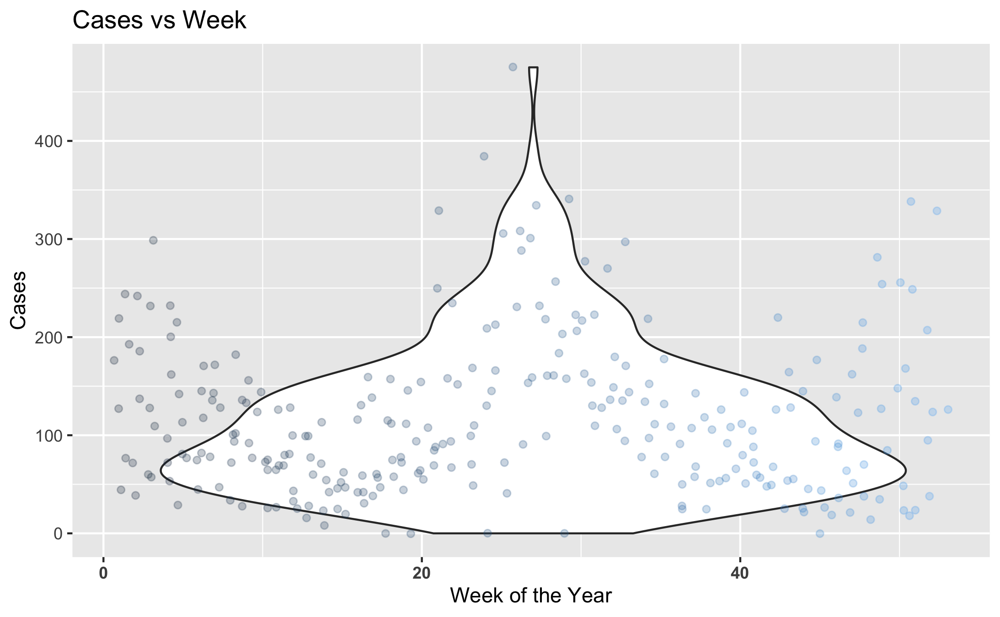
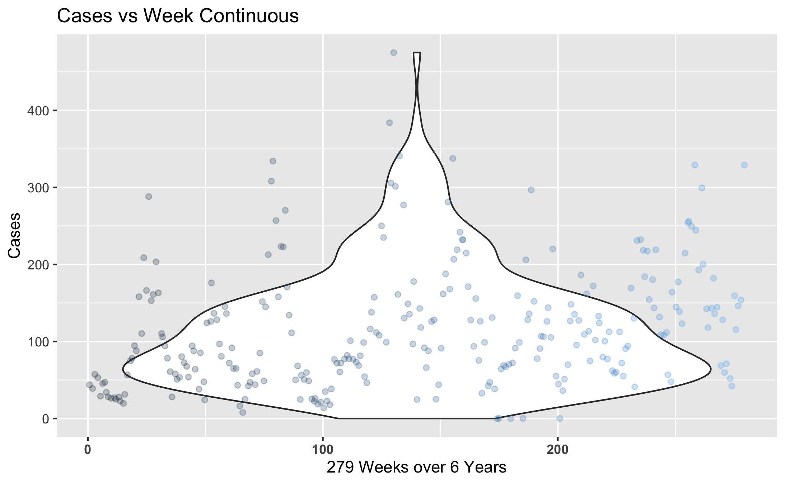
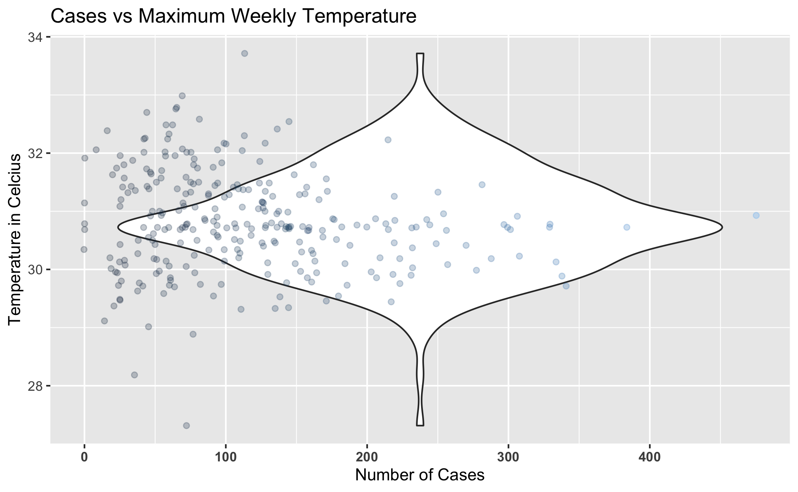
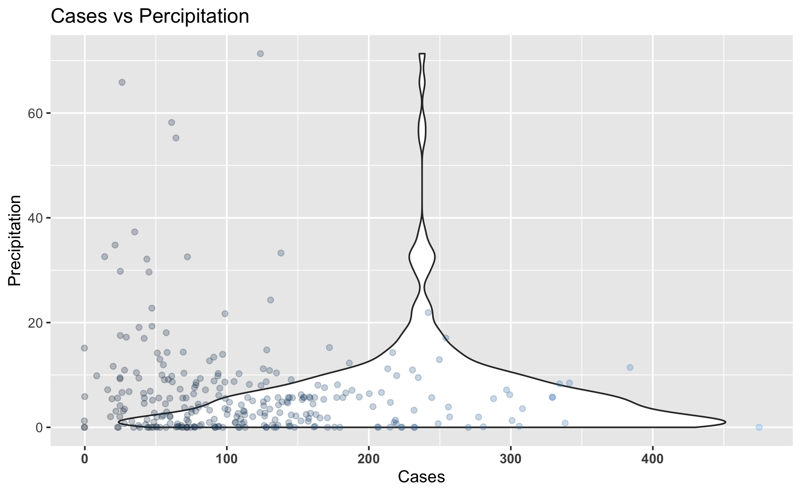
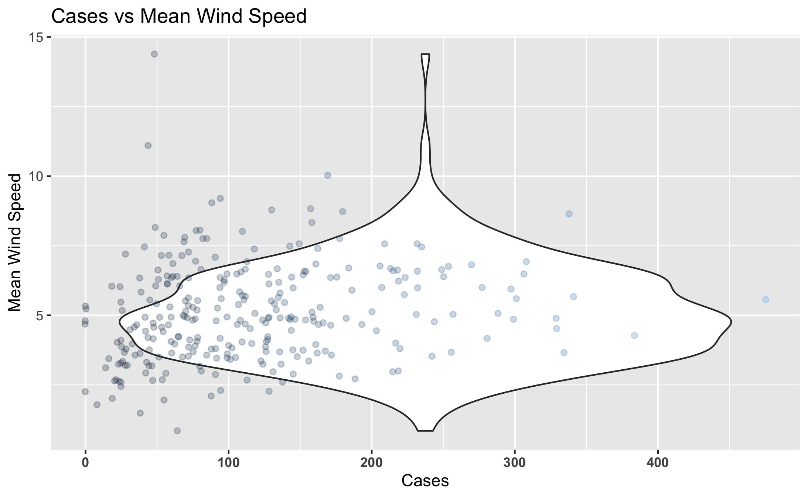
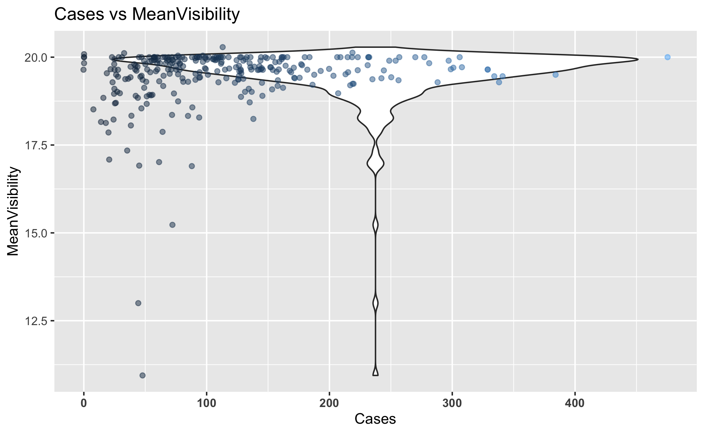

# Summary/Abstract
_Write a summary of your project._

# Illustrating setup
_This section is only there to show how to insert results from other places in the project and how to cite figures and other references. Delete this whole section at some point._


This paper [@Leek2015a] discusses types of analyses. 


Figure \@ref(fig:resultfigure) shows a result figure from the analysis.

```{r resultfigure,  fig.cap='Analysis figure.', echo=FALSE}
knitr::include_graphics("../../results/resultfigure.png")
```

Table \@ref(tab:resulttable) shows a result table from the analysis.

```{r resulttable,  echo=FALSE}
resulttable=readRDS("../../results/resulttable.rds")
knitr::kable(resulttable, caption = 'Result Table.')
```


Note that this cited reference will show up at the end of the document, the reference formatting is determined by the CSL file specified in the YAML header. Many more style files for almost any journal [are available](https://www.zotero.org/styles). You also specify the location of your bibtex reference file in the YAML. You can call your reference file anything you like, I just used the generic word `references.bib` but giving it a more descriptive name is probably better.


# Introduction (required for part 1)

## General Background Information
_Dengue is a disease caused by a family of viruses transmitted to people through the bite of an infected Aedes species (Ae. aegypti or Ae. albopictus) mosquito. Symptoms of Dengue fever include severe joint and muscle pain, swollen lymph nodes, headache, fever, exhaustion, and rash. The presence of fever, rash, and headache (the "Dengue Triad") is characteristic of dengue fever. Each year, up to 400 million people get infected with Dengue. Approximately 100 million people get sick from infection, and 22,000 die from severe Dengue. Dengue is caused by one of any of four related viruses: Dengue virus 1, 2, 3, and 4.  For this reason, a person can be infected with a Dengue virus as many as four times within their lifetime. Dengue virus is prevalent throughout the tropics and subtropics; being common in over 100 countries in the world. Forty percent of the world’s population, about 3 billion people, live in areas with a risk of Dengue. Because of this, Dengue is often a leading cause of illness in areas with risk._


## Description of data and data source
_The following data is a collective of samples of weekly notified Dengue cases and climate variables in the Colombo district of Sri Lanka between the years of 2008 to 2014. Within the data frame there are 279 rows and 12 variables. During the sample time, the 12 tested variables were: Total number of notified Dengue cases (Cases), Year (Year), Week number to locate the week within a year (Week), Week_Continuous across 6 years, Average temperature of the week (TEM), maximum temperature of the week (TMAX), Minimum temperature of the week (Tm), Sea level pressure (SLP), Relative humidity (H), Precipitation amount (PP), Mean visibility (VV), Mean wind speed (V), and Maximum sustained wind speed (VM)._

_The data was provided by Thiyanga Talagala, and published in 2018, taken from the weekly epidemiological reports published by the Epidemiological Unit, Ministry of Health, Sri Lanka. You can find the link to the data [here](https://CRAN.R-project.org/package=colmozzie)._


## Questions/Hypotheses to be Addressed
_Examine Seasonal Changes across the Timespan of the Data Collection to observe any noticeable changes that may play a role in the number of Cases of Dengue recorded._
_1 - Which variable/variables are the best indicators for Dengue?_
_2- Can the indicators for Dengue be applied to similar ecosystems across the world devoid of Dengue if the vector was introduced to that area to provide an example as to how many cases of Dengue in those areas we would see?_
_3 - Does Maximum Sustained Wind Speed play a role in lower Dengue cases?_
_4 - How does Sea Level Pressure affect Dengue and its Vector?_
_5 - Does the Vector prefer warmer or cooler temperatures in tropical/subtropical zones when spreading Dengue?_
_6 - Does Precipitation attribute to higher Dengue cases?_
_7 - What additional variables would be beneficial to include in the dataset for future studies? For example, exact longitude, latitude, etc._


# Methods and Results
_The data was provided by Thiyanga Talagala taken from the weekly epidemiological reports published by the Epidemiological Unit, Ministry of Health, Sri Lanka. Data was further cleaned by myself to better fit my analysis. Data was analyzed using R Studio software and various R packages listed throughout the repository provided by Github. Methods will include examining the variables in detail to see which ones are the best predictors and indicators for Dengue. Comparing each other variable to the number of cases will give us some decent figures to examine in order to make our analysis work._


## Data Aquisition, Import, and Cleaning
_The data was provided by Thiyanga Talagala, and published in 2018, taken from the weekly epidemiological reports published by the Epidemiological Unit, Ministry of Health, Sri Lanka. You can find the link to the data [here](https://CRAN.R-project.org/package=colmozzie). Due to the fact our data was very clean from the start, we did not require a lot of script to purify our data. I did add an additional variable that counts the weeks in a continous fashion in order to examine the data over the course of the years of collection. You can examine the cleaning script in the code folder inside the DengueProcessing_cleaning.Rmd._

## Univariate analysis
_Use a combination of text/tables/figures to explore and describe your data. You should produce plots or tables or other summary quantities for most of your variables. You definitely need to do it for the important variables, i.e. if you have main exposure or outcome variables, those need to be explored. Depending on the total number of variables in your dataset, explore all or some of the others._

_An Exploratory analysis of the cleaned Dengue dataset shows some general trends across the variables measured against the number of Cases of Dengue reported each week, and identifies specific aspects of the code that possibly warrant a deeper analysis. The first variables we examined will be listed below. Each variable was compared to the Reported Number of Dengue Cases Weekly._

```{r 1Fig, fig.cap="Number of Dengue Cases Reported Weekly Each Year.", echo=FALSE}
knitr::include_graphics("../../results/Cases_v_Year.png")
```

```{r 1Fig, fig.cap="Number of Dengue Cases Reported Each Week.", echo=FALSE}

```

```{r 1Fig, fig.cap="Number of Dengue Cases Reported Each Week Continuously.", echo=FALSE}

```

```{r 1Fig, fig.cap="Number of Dengue Cases Weekly against the Average Temperature.", echo=FALSE}
knitr::include_graphics("../../results/Cases_v_Temperature.png")
```

```{r 1Fig, fig.cap="Number of Dengue Cases Weekly against the Average Temperature.", echo=FALSE}

```

```{r 1Fig, fig.cap="Number of Dengue Cases Weekly against the Sea Level Pressure.", echo=FALSE}
knitr::include_graphics("../../results/Cases_v_SLP.png")
```

```{r 1Fig, fig.cap="Number of Dengue Cases Weekly against Precipitation.", echo=FALSE}

```

```{r 1Fig, fig.cap="Number of Dengue Cases Weekly against the Mean Wind Speed.", echo=FALSE}

```

```{r 1Fig, fig.cap="Number of Dengue Cases Weekly against Maximum Wind Speed.", echo=FALSE}
knitr::include_graphics("../../results/Cases_v_MaxWindspeed.png")
```

```{r 1Fig, fig.cap="Number of Dengue Cases Weekly against Relative Humidity.", echo=FALSE}
knitr::include_graphics("../../results/Cases_v_Humidity.png")
```

```{r 1Fig, fig.cap="Number of Dengue Cases Weekly against Mean Visibility.", echo=FALSE}

```

## Bivariate analysis
_Create plots or tables and compute simple statistics (e.g. t-tests, simple regression model with 1 predictor, etc.) to look for associations between your outcome(s) and each individual predictor variable_

_A Bivariate Analysis is the simultaneous analysis of two variables (attributes). It explores the concept of relationship between two variables, whether there exists an association and the strength of this association, or whether there are differences between two variables and the significance of these differences. For this analysis, we will examine a few variables against each other: Average temperature of the week (TEM), Relative humidity (H), Precipitation Level (PP), and Mean wind speed (V)._ 

```{r 1Fig, fig.cap="Comparison of Average Temperature versus Average Precipitation.", echo=FALSE}
knitr::include_graphics("../../results/Temp_vs_Precip.png")
```

```{r 1Fig, fig.cap="Comparison of Average Temperature versus Mean Windspeed.", echo=FALSE}
knitr::include_graphics("../../results/Temp_vs_MeanWS.png")
```

```{r 1Fig, fig.cap="Comparison of Average Temperature versus Relative Humidity.", echo=FALSE}
knitr::include_graphics("../../results/Temp_vs_Humid.png")
```

```{r 1Fig, fig.cap="Comparison of Average Precipitation versus the Mean Windspeed.", echo=FALSE}
knitr::include_graphics("../../results/Precip_vs_MeanWS.png")
```

```{r 1Fig, fig.cap="Comparison of Relative Humidity versus Average Precipitation.", echo=FALSE}
knitr::include_graphics("../../results/Humid_v_Precip.png")
```

```{r 1Fig, fig.cap="Comparison of Relative Humidity versus Mean Windspeed.", echo=FALSE}
knitr::include_graphics("../../results/Humid_vs_MeanWS.png")
```

_From what we can see, we can make some general assumptions based on the graphs as well as what we know to be common  knowledge about weather effects. Looking at the graphs, Lower Temperatures are usually correlated with more more Percipitation, and Higher Humidity is correlated with higher Percipitation. While the other graphs do not seem to have much correlation._

### Seasonal Changes

_Another aspect I want to look at would be examining seasonal changes and seeing as how they compare to the number of Cases of Dengue. Using this we can hopefully find some additional correlations and break down the information to get a more in depth visualization of how the number of cases of Dengue changes seasonally._

_Here we examine the Temperature changes across the years._

```{r 1Fig, fig.cap="Comparison of Average Temperature Across Years.", echo=FALSE}
knitr::include_graphics("../../results/Year_vs_Temp.png")
```

```{r 1Fig, fig.cap="Comparison of Average Temperature Across Each Week Continuously.", echo=FALSE}
knitr::include_graphics("../../results/WeekCont_vs_Temp.png")
```

```{r 1Fig, fig.cap="Comparison of Average Temperature Across Each Week of the Year.", echo=FALSE}
knitr::include_graphics("../../results/Week_vs_Temp.png")
```

_Our temperatures seem to fluctuate normally throughout the months and years present. Now let's check out some other variables in a comparison before finally comparing it to the Cases of Dengue. What we are looking for is something interesting to account for months with higher cases of Dengue. Here we will check out how the Precipitation changes over time._

```{r 1Fig, fig.cap="Comparison of Average Temperature Across Years.", echo=FALSE}
knitr::include_graphics("../../results/Year_vs_Precip.png")
```

```{r 1Fig, fig.cap="Comparison of Average Temperature Across Each Week Continuously.", echo=FALSE}
knitr::include_graphics("../../results/WeekCont_vs_Precip.png")
```

```{r 1Fig, fig.cap="Comparison of Average Temperature Across Each Week of the Year.", echo=FALSE}
knitr::include_graphics("../../results/Week_vs_Precip.png")
```

_Now we will examine the changes in Humidity._

```{r 1Fig, fig.cap="Comparison of Relative Humidity Across Years.", echo=FALSE}
knitr::include_graphics("../../results/Year_vs_Humid.png")
```

```{r 1Fig, fig.cap="Comparison of Relative Humidity Across Each Week Continuously.", echo=FALSE}
knitr::include_graphics("../../results/WeekCont_vs_Humid.png")
```

```{r 1Fig, fig.cap="Comparison of Relative Humidity Across Each Week of the Year.", echo=FALSE}
knitr::include_graphics("../../results/Week_vs_Humid.png")
```

_Here are the changes in the Mean Windspeed._

```{r 1Fig, fig.cap="Comparison of Mean Windspeed Across Years.", echo=FALSE}
knitr::include_graphics("../../results/Year_vs_Windspeed.png")
```

```{r 1Fig, fig.cap="Comparison of Mean Windspeed Across Each Week Continuously.", echo=FALSE}
knitr::include_graphics("../../results/WeekCont_vs_Windspeed.png")
```

```{r 1Fig, fig.cap="Comparison of Average Temperature Across Each Week of the Year.", echo=FALSE}
knitr::include_graphics("../../results/Week_vs_Windspeed.png")
```

## Full analysis
_Use one or several suitable statistical/machine learning methods to analyze your data and to produce meaningful figures, tables, etc. This might again be code that is best placed in one or several separate R scripts that need to be well documented. You can then load the results produced by this code_

# Discussion

## Summary and Interpretation
_Summarize what you did, what you found and what it means._

## Strengths and Limitations
_Discuss what you perceive as strengths and limitations of your analysis._

## Conclusions
_What are the main take-home messages?_


_Include citations in your Rmd file using bibtex, the list of references will automatically be placed at the end_

# References

